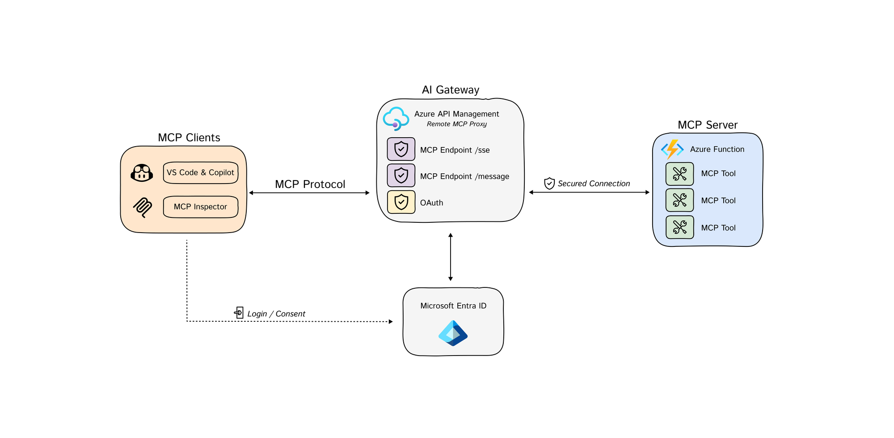

<!--
---
name: Remote MCP  using Azure API Management
description: Use Azure API Management as the AI Gateway for MCP Servers using Azure Functions  
page_type: sample
languages:
- python
- bicep
- azdeveloper
products:
- azure-api-management
- azure-functions
- azure
urlFragment: remote-mcp-apim-functions-python
---
-->

# Secure Remote MCP Servers using Azure API Management (Experimental)


Azure API Management acts as the [AI Gateway](https://github.com/Azure-Samples/AI-Gateway) for MCP servers. 

This sample implements the latest [MCP Authorization specification](https://modelcontextprotocol.io/specification/2025-03-26/basic/authorization#2-10-third-party-authorization-flow)

This is a [sequence diagram](infra/app/apim-oauth/diagrams/diagrams.md) to understand the flow.

## Deploy Remote MCP Server to Azure

1. Register `Microsoft.App` resource provider.
    * If you are using Azure CLI, run `az provider register --namespace Microsoft.App --wait`.
    * If you are using Azure PowerShell, run `Register-AzResourceProvider -ProviderNamespace Microsoft.App`. Then run `(Get-AzResourceProvider -ProviderNamespace Microsoft.App).RegistrationState` after some time to check if the registration is complete.

2. Run this [azd](https://aka.ms/azd) command to provision the api management service, function app(with code) and all other required Azure resources

    ```shell
    azd up
    ```

### Test with MCP Inspector

1. In a **new terminal window**, install and run MCP Inspector

    ```shell
    npx @modelcontextprotocol/inspector
    ```

1. CTRL click to load the MCP Inspector web app from the URL displayed by the app (e.g. http://127.0.0.1:6274/#resources)
1. Set the transport type to `SSE`
1. Set the URL to your running API Management SSE endpoint displayed after `azd up` and **Connect**:

    ```shell
    https://<apim-servicename-from-azd-output>.azure-api.net/mcp/sse
    ```

5. **List Tools**.  Click on a tool and **Run Tool**.  


## Technical Architecture Overview

This solution deploys a secure MCP (Model Context Protocol) server infrastructure on Azure. The architecture implements a multi-layered security model with Azure API Management serving as an intelligent gateway that handles authentication, authorization, and request routing.



### Deployed Azure Resources

The infrastructure provisions the following Azure resources:

#### Core Gateway Infrastructure
- **Azure API Management (APIM)** - The central security gateway that exposes both OAuth and MCP APIs
  - **SKU**: BasicV2 (configurable)
  - **Identity**: System-assigned and user-assigned managed identities
  - **Purpose**: Handles authentication flows, request validation, and secure proxying to backend services

#### Backend Compute
- **Azure Function App** - Hosts the MCP server implementation
  - **Runtime**: Python 3.11 on Flex Consumption plan
  - **Authentication**: Function-level authentication with managed identity integration
  - **Purpose**: Executes MCP tools and operations (snippet management in this example)

#### Storage and Data
- **Azure Storage Account** - Provides multiple storage functions
  - **Function hosting**: Stores function app deployment packages
  - **Application data**: Blob container for snippet storage
  - **Security**: Configured with managed identity access and optional private endpoints

#### Security and Identity
- **User-Assigned Managed Identity** - Enables secure service-to-service authentication
  - **Purpose**: Allows Function App to access Storage and Application Insights without secrets
  - **Permissions**: Storage Blob Data Owner, Storage Queue Data Contributor, Monitoring Metrics Publisher

- **Entra ID Application Registration** - OAuth2/OpenID Connect client for authentication
  - **Purpose**: Enables third-party authorization flow per MCP specification
  - **Configuration**: PKCE-enabled public client with custom redirect URIs

#### Monitoring and Observability
- **Application Insights** - Provides telemetry and monitoring
- **Log Analytics Workspace** - Centralized logging and analytics

#### Optional Network Security
- **Virtual Network (VNet)** - When `vnetEnabled` is true
  - **Private Endpoints**: Secure connectivity to Storage Account
  - **Network Isolation**: Functions and storage communicate over private network

### Why These Resources?

**Azure API Management** serves as the security perimeter, implementing:
- OAuth 2.0/PKCE authentication flows per MCP specification
- Session key encryption/decryption for secure API access  
- Request validation and header injection
- Rate limiting and throttling capabilities
- Centralized policy management

**Azure Functions** provides:
- Serverless, pay-per-use compute model
- Native integration with Azure services
- Automatic scaling based on demand
- Built-in monitoring and diagnostics

**Managed Identities** eliminate the need for:
- Service credentials management
- Secret rotation processes
- Credential exposure risks

## Azure API Management Configuration Details

The APIM instance is configured with two primary APIs that work together to implement the MCP authorization specification:

### OAuth API (`/oauth/*`)

This API implements the complete OAuth 2.0 authorization server functionality required by the MCP specification:

#### Endpoints and Operations

**Authorization Endpoint** (`GET /authorize`)
- **Purpose**: Initiates the OAuth 2.0/PKCE flow
- **Policy Logic**:
  1. Extracts PKCE parameters from MCP client request
  2. Checks for existing user consent (via cookies)
  3. Redirects to consent page if consent not granted
  4. Generates new PKCE parameters for Entra ID communication
  5. Stores authentication state in APIM cache
  6. Redirects user to Entra ID for authentication

**Consent Management** (`GET/POST /consent`)
- **Purpose**: Handles user consent for MCP client access
- **Features**: Consent persistence via secure cookies

**OAuth Metadata Endpoint** (`GET /.well-known/oauth-authorization-server`)
- **Purpose**: Publishes OAuth server configuration per RFC 8414
- **Returns**: JSON metadata about supported endpoints, flows, and capabilities
  
**Client Registration** (`POST /register`)
- **Purpose**: Supports dynamic client registration per MCP specification

**Token Endpoint** (`POST /token`)
- **Purpose**: Exchanges authorization codes for access tokens
- **Policy Logic**:
  1. Validates authorization code and PKCE verifier from MCP client
  2. Exchanges Entra ID authorization code for access tokens
  3. Generates encrypted session key for MCP API access
  4. Caches the access token with session key mapping
  5. Returns encrypted session key to MCP client

#### Named Values and Configuration

The OAuth API uses several APIM Named Values for configuration:
- `McpClientId` - The registered Entra ID application client ID
- `EntraIDFicClientId` - Service identity client ID for token exchange
- `APIMGatewayURL` - Base URL for callback and metadata endpoints
- `OAuthScopes` - Requested OAuth scopes (`openid` + Microsoft Graph)
- `EncryptionKey` / `EncryptionIV` - For session key encryption

### MCP API (`/mcp/*`)

This API provides the actual MCP protocol endpoints with security enforcement:

#### Endpoints and Operations

**Server-Sent Events Endpoint** (`GET /sse`)
- **Purpose**: Establishes real-time communication channel for MCP protocol
- **Security**: Requires valid encrypted session token

**Message Endpoint** (`POST /message`)
- **Purpose**: Handles MCP protocol messages and tool invocations
- **Security**: Requires valid encrypted session token

#### Security Policy Implementation

The MCP API applies a comprehensive security policy to all operations:

1. **Authorization Header Validation**
   ```xml
   <check-header name="Authorization" failed-check-httpcode="401" 
                 failed-check-error-message="Not authorized" ignore-case="false" />
   ```

2. **Session Key Decryption**
   - Extracts encrypted session key from Authorization header
   - Decrypts using AES with stored key and IV
   - Validates token format and structure

3. **Token Cache Lookup**
   ```xml
   <cache-lookup-value key="@($"EntraToken-{context.Variables.GetValueOrDefault("decryptedSessionKey")}")" 
                       variable-name="accessToken" />
   ```

4. **Access Token Validation**
   - Verifies cached access token exists and is valid
   - Returns 401 with proper WWW-Authenticate header if invalid

5. **Backend Authentication**
   ```xml
   <set-header name="x-functions-key" exists-action="override">
       <value>{{function-host-key}}</value>
   </set-header>
   ```

### Security Model

The solution implements a sophisticated multi-layer security model:

**Layer 1: OAuth 2.0/PKCE Authentication**
- MCP clients must complete full OAuth flow with Entra ID
- PKCE prevents authorization code interception attacks
- User consent management with persistent preferences

**Layer 2: Session Key Encryption**
- Access tokens are never exposed to MCP clients
- Encrypted session keys provide time-bounded access
- AES encryption with secure key management in APIM

**Layer 3: Function-Level Security**
- Function host keys protect direct access to Azure Functions
- Managed identity ensures secure service-to-service communication
- Network isolation available via VNet integration

**Layer 4: Azure Platform Security**
- All traffic encrypted in transit (TLS)
- Storage access via managed identities
- Audit logging through Application Insights

This layered approach ensures that even if one security boundary is compromised, multiple additional protections remain in place.


